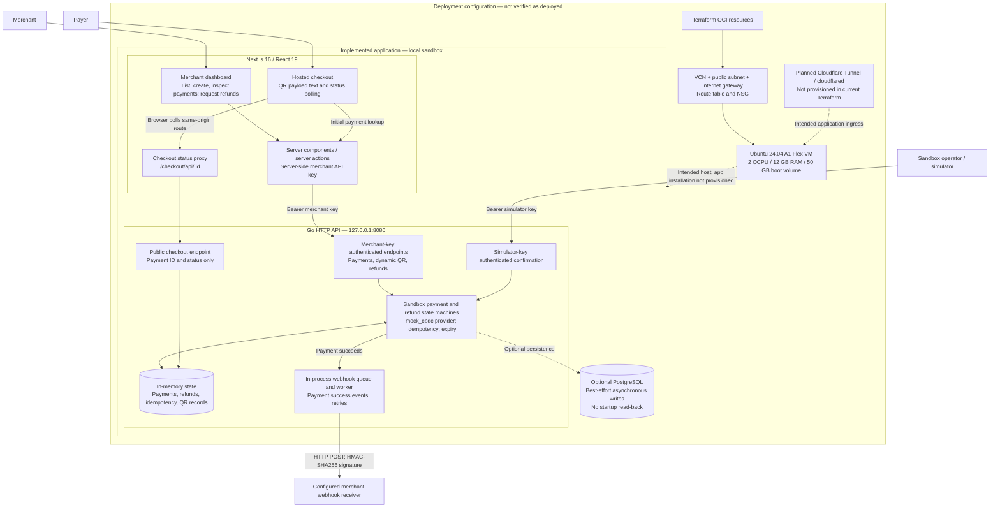

# RaumPay architecture

Current sandbox implementation and infrastructure configuration. This is not a production payment system; no live bank, wallet, or CBDC network integration is implemented.

## Scope and caveats

- Solid application arrows show implemented call paths. Dashed arrows indicate optional persistence or intended deployment relationships.
- The API requires `RAUMPAY_MODE=sandbox`. Payment confirmation is simulated; checkout displays a payload string, not a rendered QR image or a working wallet integration.
- In-memory maps are the read path even when `RAUMPAY_DATABASE_URL` enables PostgreSQL writes. Persisted state is not restored at startup; the webhook queue is also in memory.
- Terraform defines OCI infrastructure, not application deployment or Cloudflare configuration. Despite its tunnel-only comments, its NSG currently allows SSH from `0.0.0.0/0`; do not interpret this diagram as evidence of a closed management surface.
- The merchant API key is used server-side by Next.js. Merchant dashboard user authentication is not shown because it is not implemented in the inspected application.

## Source map

- `apps/merchant-dashboard/app/` — dashboard, payment details, hosted checkout, and polling proxy.
- `apps/merchant-dashboard/lib/api.ts` — server-side API client.
- `apps/raumpay-api/main.go` and `api.go` — sandbox startup, routes, payment state, and confirmation.
- `apps/raumpay-api/qr.go`, `refunds.go`, and `webhooks.go` — QR payloads, refunds, and webhook delivery.
- `apps/raumpay-api/store.go` — optional PostgreSQL writes.
- `deploy/terraform/main.tf` — OCI network and compute configuration.
